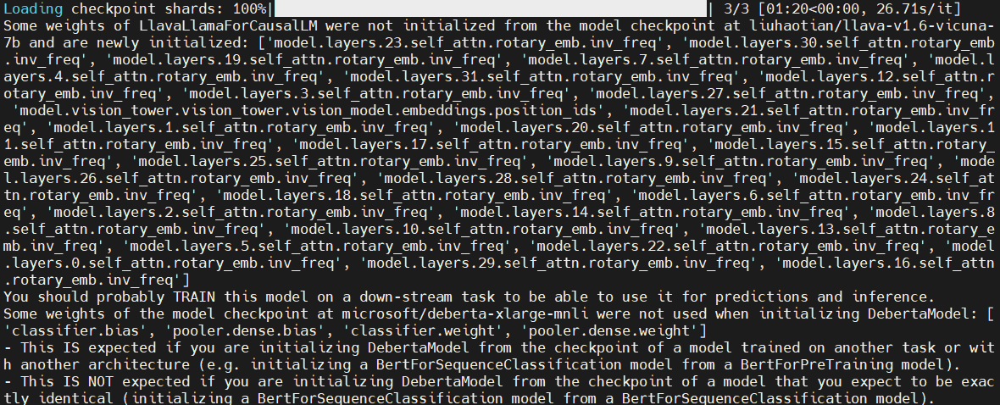
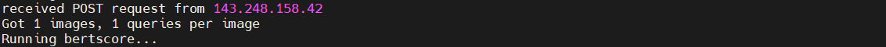

# LLaVA Server

Serves LLaVA inference using an HTTP server. Supports batched inference and caches the embeddings for each image in order to produce multiple responses per image more efficiently.

## Installation
Requires Python 3.10 or newer.

```bash
cd LLAVA
pip install -e .
```

## Open Port
Open server port for communication with DDPO server.
```bash
# Open port 8000
sudo firewall-cmd --add-port=8000/tcp --permanent
sudo firewall-cmd --reload

# Close port 8000
sudo firewall-cmd --remove-port=8000/tcp --permanent
sudo firewall-cmd --reload
```


## RUN
```bash
cd ..
CUDA_VISIBLE_DEVICES=0 gunicorn -c LLAVA/gunicorn.conf.py "LLAVA.app:create_app()"
```
-> GPU VRAM required : ~ 35GB\
-> Must modify `gunicorn.conf.py` to change the number of GPUs.(Currently set to use 1 GPU.)\

If the LLava server terminal displays logs like the image below, it means the LLava code is running correctly on the server.


When a request arrives from the DDPO execution server, you will see logs like the following.

