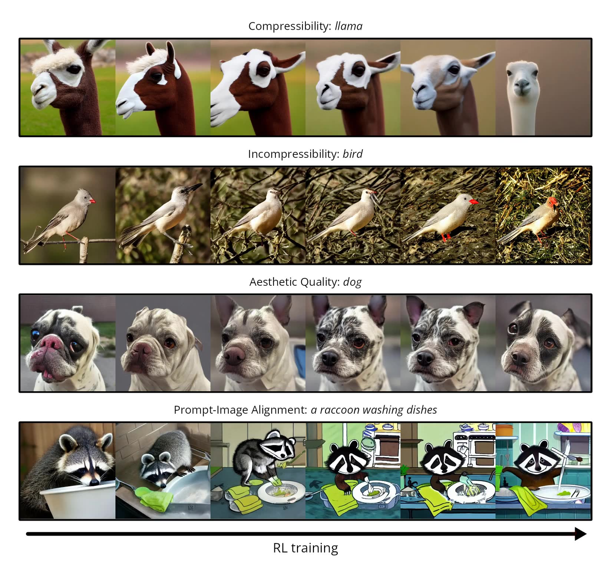

# DDPO Pytorch Version

This is an implementation of [Denoising Diffusion Policy Optimization (DDPO)](https://rl-diffusion.github.io/) in PyTorch with support for [low-rank adaptation (LoRA)](https://huggingface.co/docs/diffusers/training/lora). Unlike our original research code (which you can find [here](https://github.com/jannerm/ddpo)), this implementation runs on GPUs, and if LoRA is enabled, requires less than 10GB of GPU memory to finetune Stable Diffusion!



## Installation
Requires Python 3.10 or newer.

```bash
git clone git@github.com:chaeraemong/DDPO.git

conda create -n ddpo
conda activate ddpo

cd DDPO    # for DDPO server setup
cd LLAVA   # for LLaVA server setup
```

## Notice
Both train.py (DDPO) and app.py (LLAVA) must be run from inside the DDPO directory.
